# Mermaid 功能展示手册

这个文件用于快速体验 Mermaid 在 Markdown 中可绘制的常见图表。  
在 VS Code 中打开本文件后，使用 Markdown 预览即可看到效果。

## 1) Flowchart（流程图）
适合：算法流程、条件分支、系统处理流程。

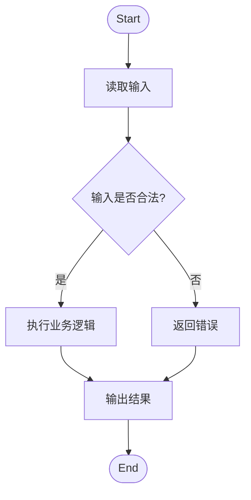

## 2) Sequence Diagram（时序图）
适合：接口调用链、服务间交互、消息流程。

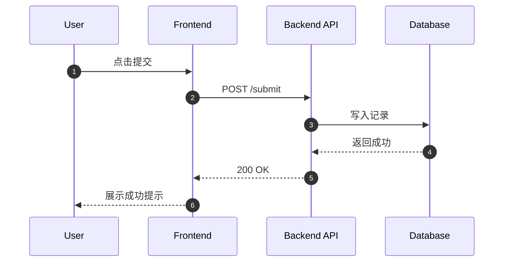

## 3) Class Diagram（类图）
适合：面向对象建模、代码结构梳理。

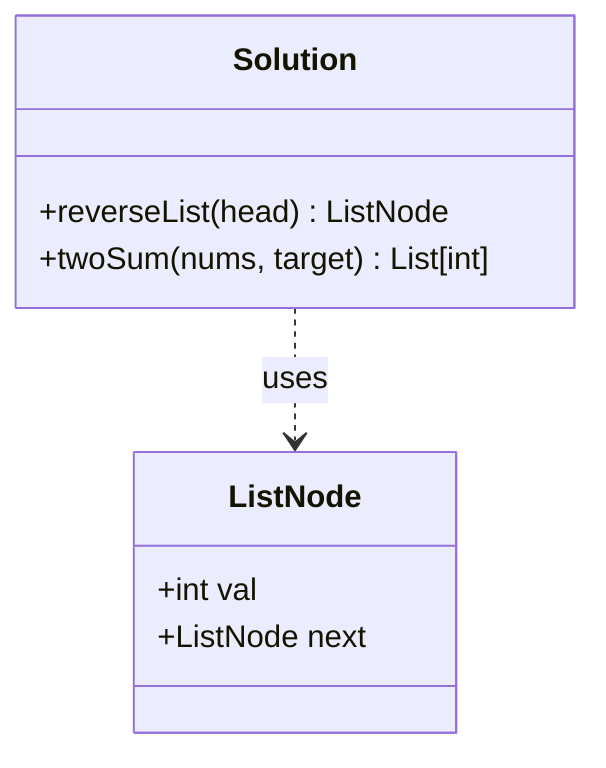

## 4) State Diagram（状态图）
适合：状态机、任务生命周期、订单状态流转。

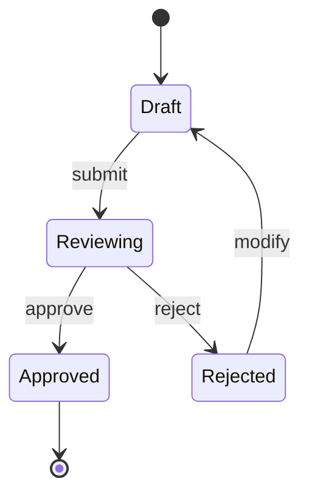

## 5) ER Diagram（实体关系图）
适合：数据库表关系、字段结构说明。

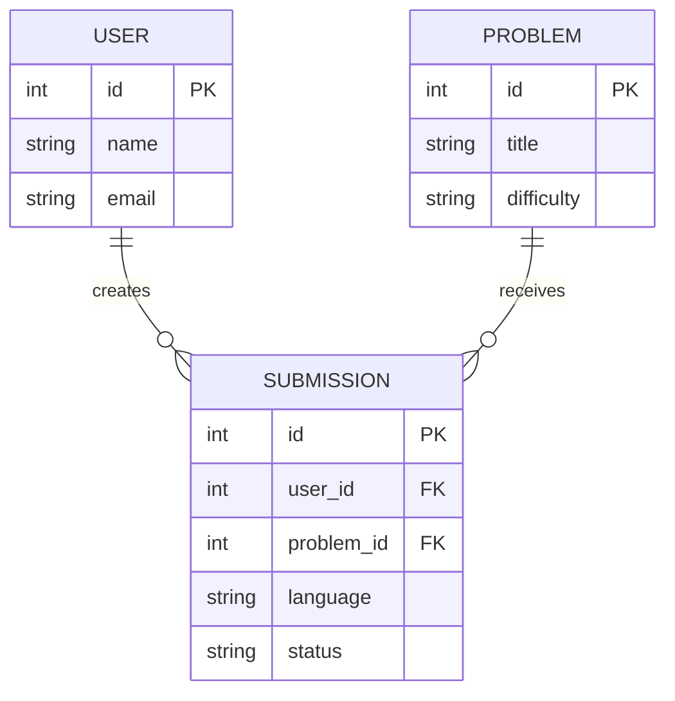

## 6) Gantt（甘特图）
适合：学习计划、项目排期、迭代节奏。

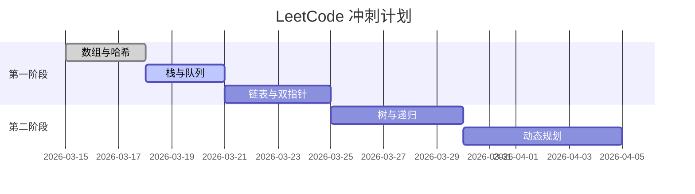

## 7) Pie（饼图）
适合：占比展示、题型分布。

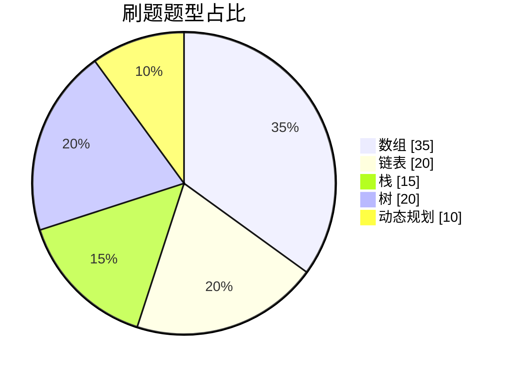

## 8) Journey（用户旅程图）
适合：用户体验路径、学习过程可视化。

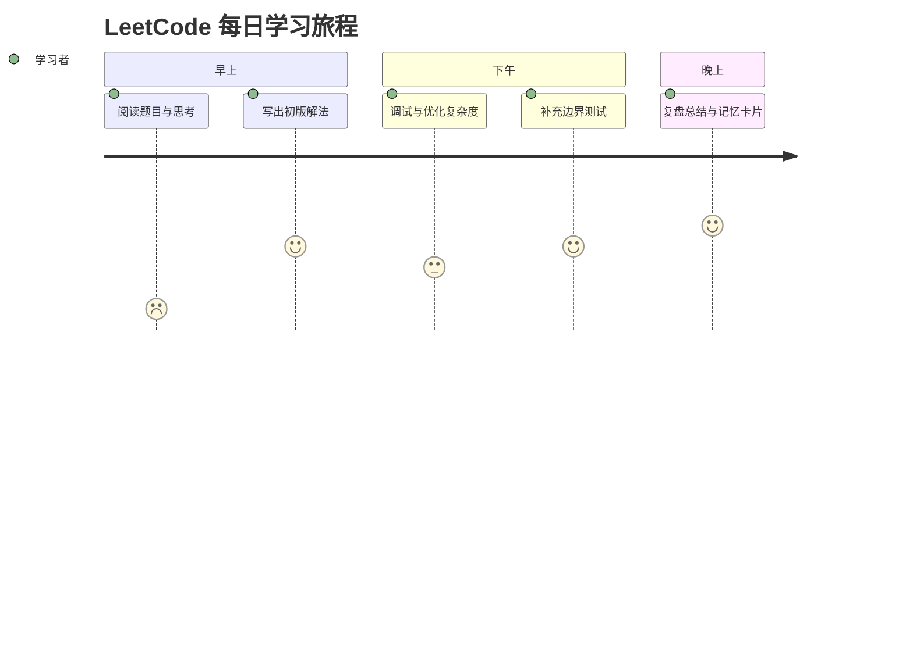

## 9) Git Graph（Git 提交图）
适合：分支策略、提交关系说明。

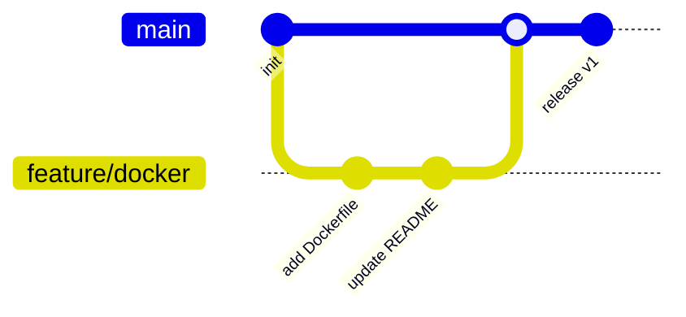

## 10) Mindmap（思维导图）
适合：知识体系整理、面试知识图谱。

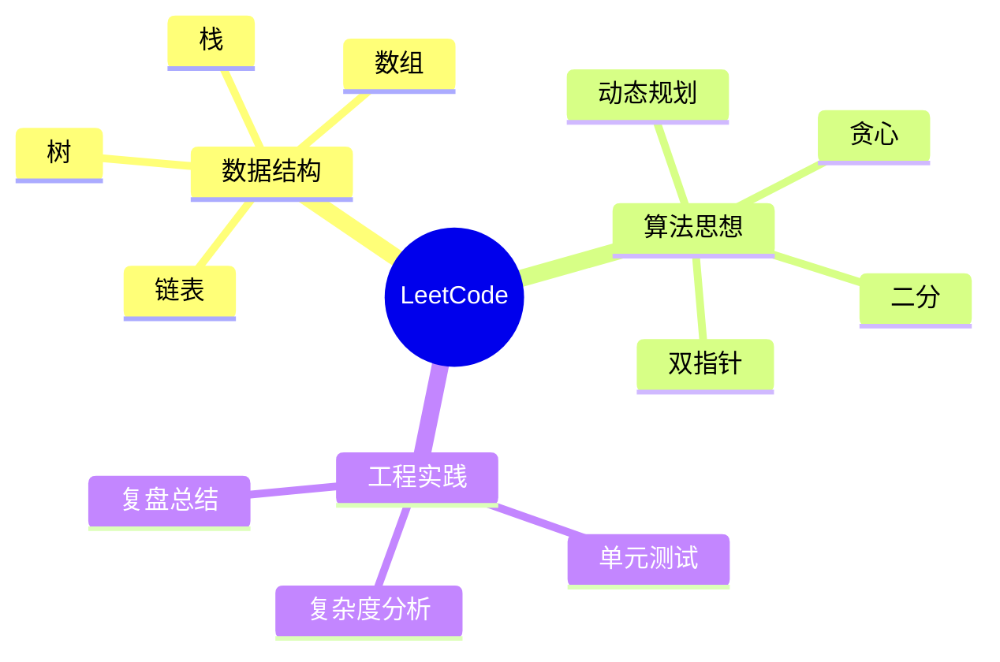

## 11) Timeline（时间线）
适合：里程碑展示、学习进度记录。

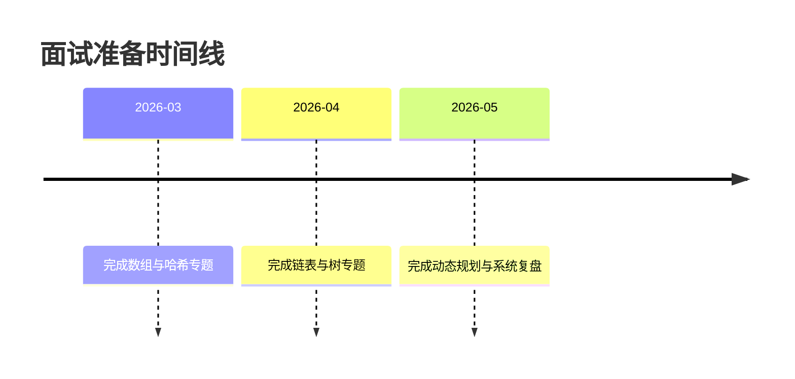

## 12) Requirement Diagram（需求图）
适合：需求与实现映射、测试覆盖梳理。

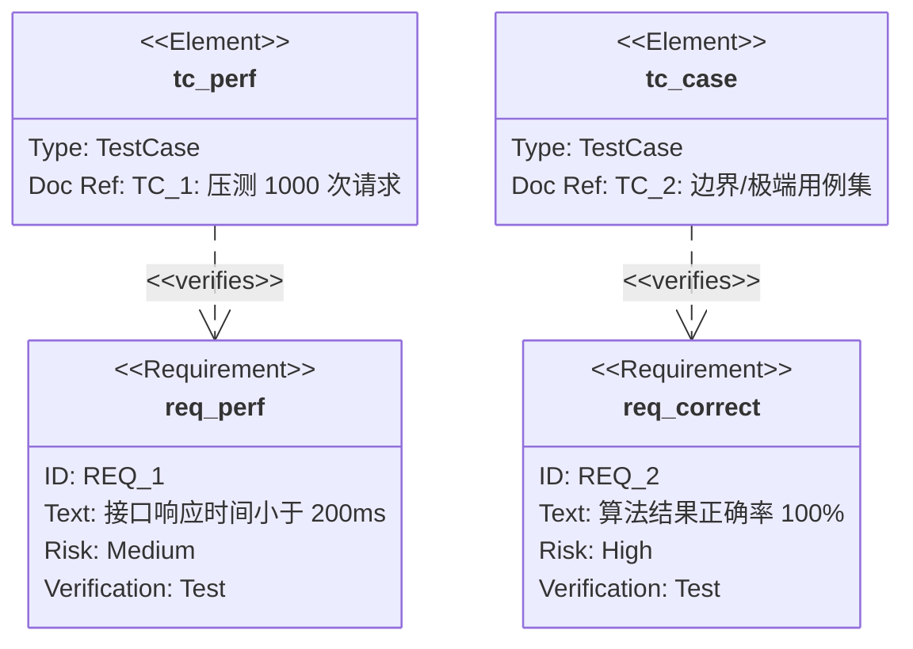

## 13) XY Chart（实验性）
适合：趋势、对比分析（不同算法耗时）。

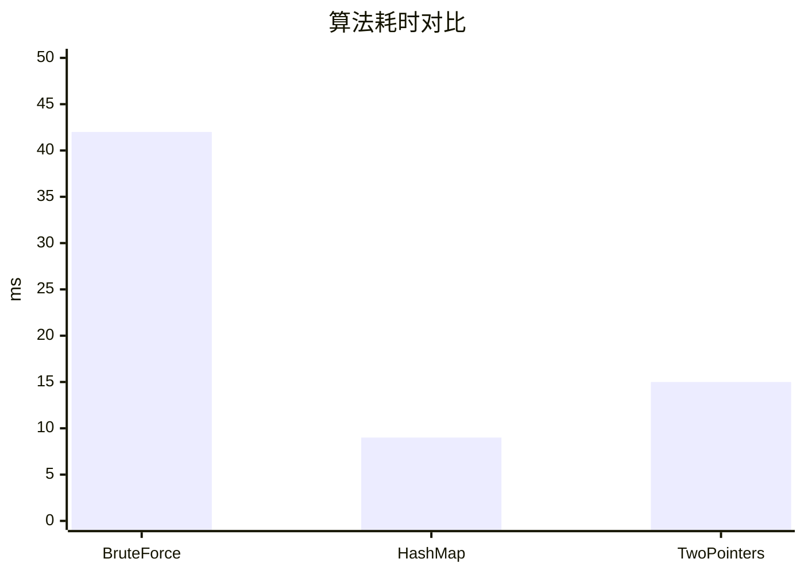

## 14) Quadrant Chart（实验性）
适合：策略评估、方案对比。

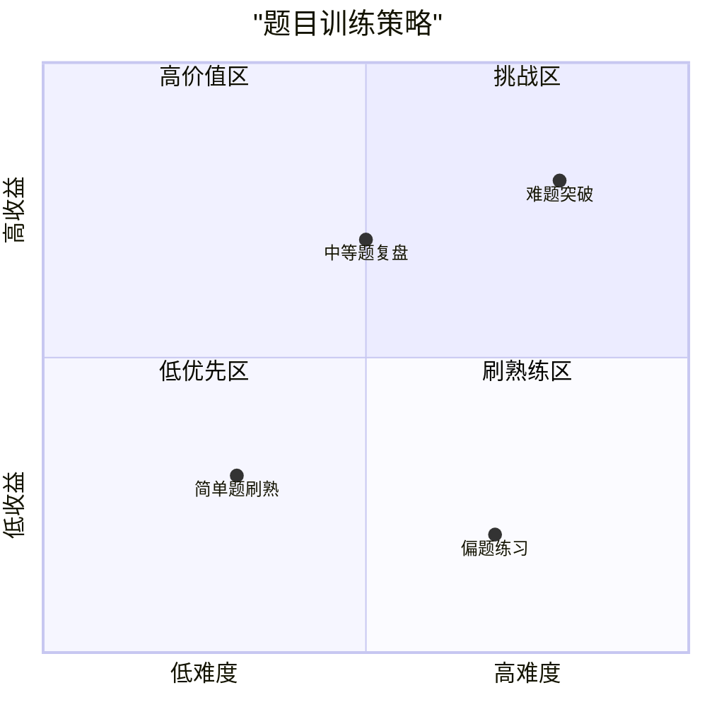

## 快速说明
- 如果某些“实验性图表”在你的插件版本不显示，先升级 Mermaid 插件或切换为前面的基础图表类型。
- 最常用、兼容最好的类型：`flowchart`、`sequenceDiagram`、`classDiagram`、`stateDiagram-v2`、`erDiagram`、`gantt`、`pie`。
